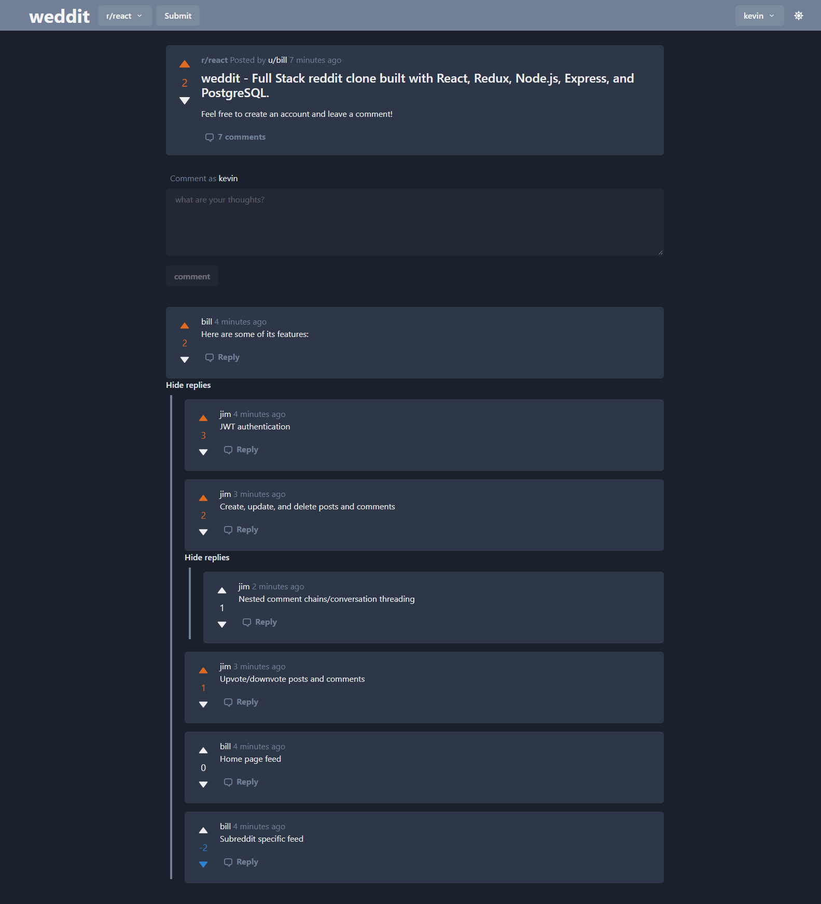

# weddit

Full stack reddit clone built with React, Redux, Node.js, Express, and PostgreSQL.

Deployed at https://weddit.netlify.app/

Note: The backend is hosted on heroku free tier (https://weddit-backend.herokuapp.com/), which may lead to slow cold starts.

## Features
- JWT authentication
- Create, update, and delete posts and comments
- Upvote/downvote posts and comments
- Nested comments threading
- Home page feed (front page)
- Subreddit specific feed
- Create subreddits
- Light and dark mode
- ... and more to come!

## Screenshots
<p align="center">
  <a href="#">
    
  </a>
</p>

## Installation
1. Clone this repository

```
git clone https://github.com/tacticaltofu/reddit-clone.git
cd reddit-clone
```

2. Install backend dependencies

```
cd backend
npm install
```

3. Install frontend dependencies

```
cd frontend
npm install
```

4. Create config folder in the backend

```
cd backend
mkdir config
```

5. Configure environment variables. Create a `dev.env` file in the config folder, and paste the following (filling in your own postgres password and JWT secret)
```
PORT=5000
PG_HOST=localhost
PG_PORT=5432
PG_DBNAME=reddit-clone
PG_USER=postgres
PG_PASSWORD=<YOUR_PASSWORD>
JWT_SECRET=<YOUR_SECRET>

```

6. Create a postgres database named 'reddit-clone'

7. Run the database migrations

```
cd backend
npm run db-migrate up
```

## Usage
1. Start server

```
cd backend
npm run dev
```

2. Start client
```
cd frontend
npm start
```